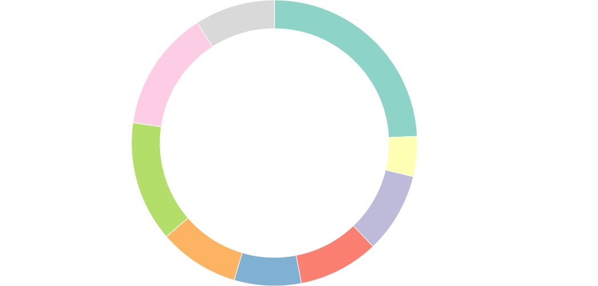
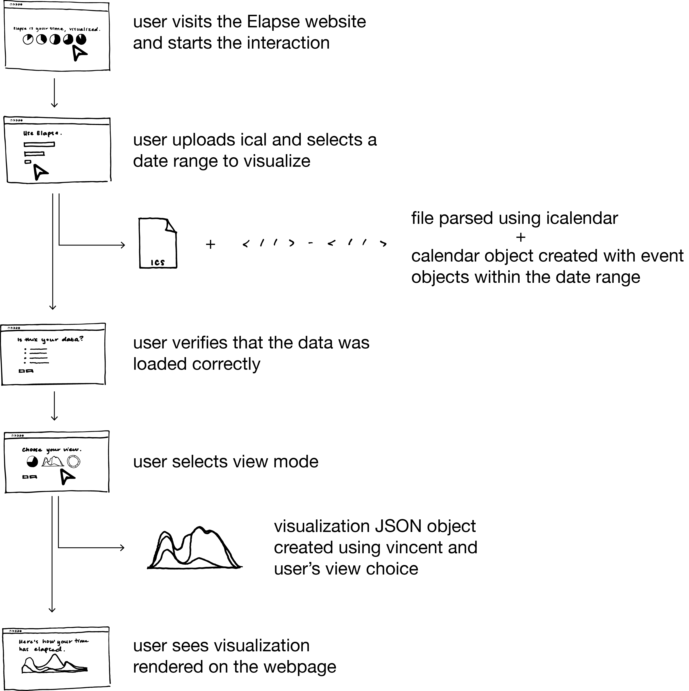
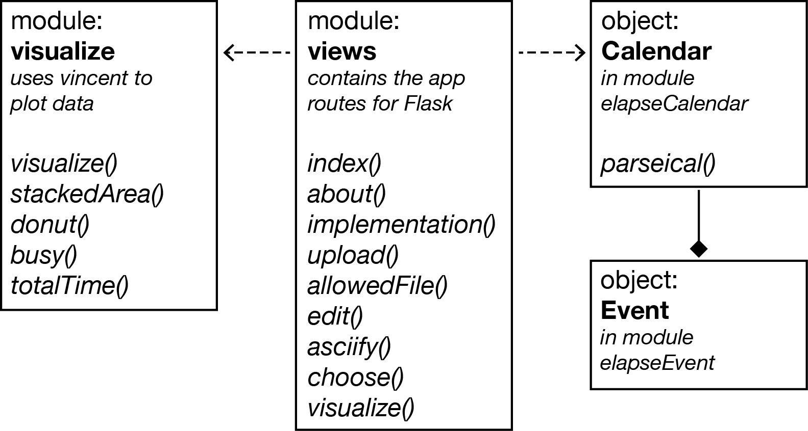

# Elapse
##### Elapse is a time visualization webapp that allows busy people to rationalize their busy lives.

## Using Elapse
To use the app, visit [elapseapp.herokuapp.com](http://elapseapp.herokuapp.com).

## Running Elapse locally
If you want to run Elapse locally, first clone our git repository.

    $ git clone https://github.com/aehoppe/Elapse
    $ cd Elapse

Because we use Flask, we recommend using a virtual environment. The following will create one named `flask`:

    $ sudo pip2 install virtualenv
    $ python2.7 -m virtualenv flask

Activate the virtual environment

    $ source flask/bin/activate

and install dependencies

    $ flask/bin/pip install -r requirements.txt

Then you're ready to go, start up a local web server

    $ ./run.py

and go to `localhost:5000` in your browser of choice.

### Dependencies
Elapse makes heavy use of the following dependencies:
- [Flask](http://flask.pocoo.org)
    - [flask_wtf](https://flask-wtf.readthedocs.org/en/latest/)
    - [werkzeug](http://werkzeug.pocoo.org)
    - [Jinja2](http://jinja.pocoo.org/docs/dev/)
- [Heroku](https://www.heroku.com)
- [icalendar](https://github.com/collective/icalendar)
- [vincent](https://github.com/wrobstory/vincent)
- [Bootstrap](http://getbootstrap.com)

Elapse's other dependencies are listed in [requirements.txt](https://github.com/aehoppe/Elapse/blob/master/requirements.txt). To install all dependencies, run the following on the command line:

    $pip install -r requirements.txt

## Examples
Below are a few examples of the visualizations that Elapse creates.

Stacked Area:

Donut:

## Implementation
This project was developed with Python, HTML, CSS, and a little bit of JavaScript. 

First, an overview of the user-software interactions that occur when using Elapse:

The user starts the interaction by going to [our url] and selecting Use Elapse. from the homepage.  The user is then prompted to upload their calendar data as a .ics file and select a week to visualize.  The ical is received and parsed for events within the selected date range, and these events are stored within our own data structure.  These events are then handed back to the user on a webpage, where the user can edit some of their attributes as desired.  Any necessary modifications to the events stored are then made.  The user is prompted to select a visualization mode, and their calendar information is then visualized on a webpage.

Our backend development was done in Python, and makes use of the [Flask](http://flask.pocoo.org) framework for webification.  The users’ upload form was created with [flask_wtf](https://flask-wtf.readthedocs.org/en/latest/).  We parse users’ ical (.ics) files using the [icalendar](https://github.com/collective/icalendar) library, and store the data as elapseEvent objects within an elapseCalendar object.  We used the [vincent](https://github.com/wrobstory/vincent) library to visualize our data.  Vincent is a wrapper for [vega](https://vega.github.io/vega/), which is a wrapper for [d3.js](https://d3js.org).  We had initially hoped to simply do the visualization, and all data processing in JavaScript, but decided to find a Python alternative so that we could focus on improving our Python skills as opposed to working in an entirely unfamiliar language.  With vincent, we generate JSON object for the visualization, which is then rendered in an HTML template.

On the frontend, we use JavaScript and jQuery to render the visualization JSON object with the HTML template, as well as to generate the user’s event-verification interface.  For the website design, we use the [Bootstrap](http://getbootstrap.com) framework, and employ CSS flexboxes in a few cases.  The webapp is hosted on [Heroku](https://www.heroku.com).

## License
Eventually, Elapse will be licensed (probably with an MIT License).  It isn't yet.

## Contributors
Elapse was created by [Gaby Clarke](https://github.com/gabyclarke) and [Alexander Hoppe](https://github.com/aehoppe) for our Software Design course at [Olin College of Engineering](http://www.olin.edu).  Software Design is an introduction to computation and software taught in Python.
