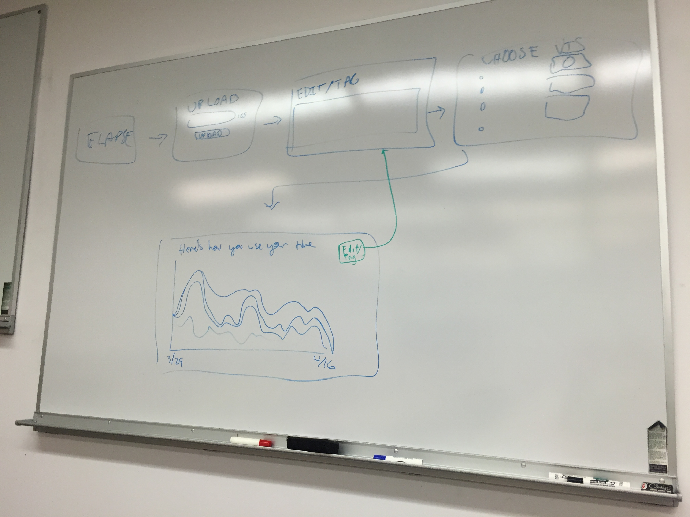
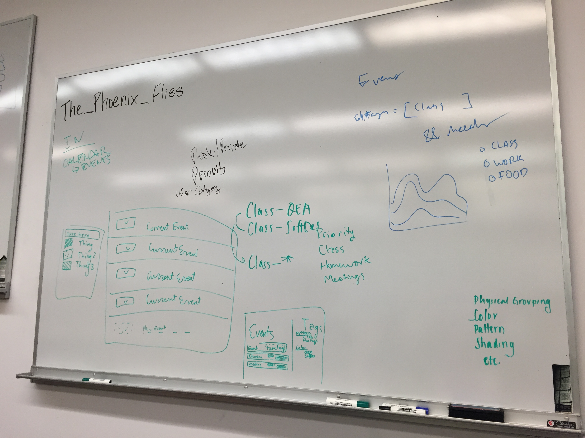
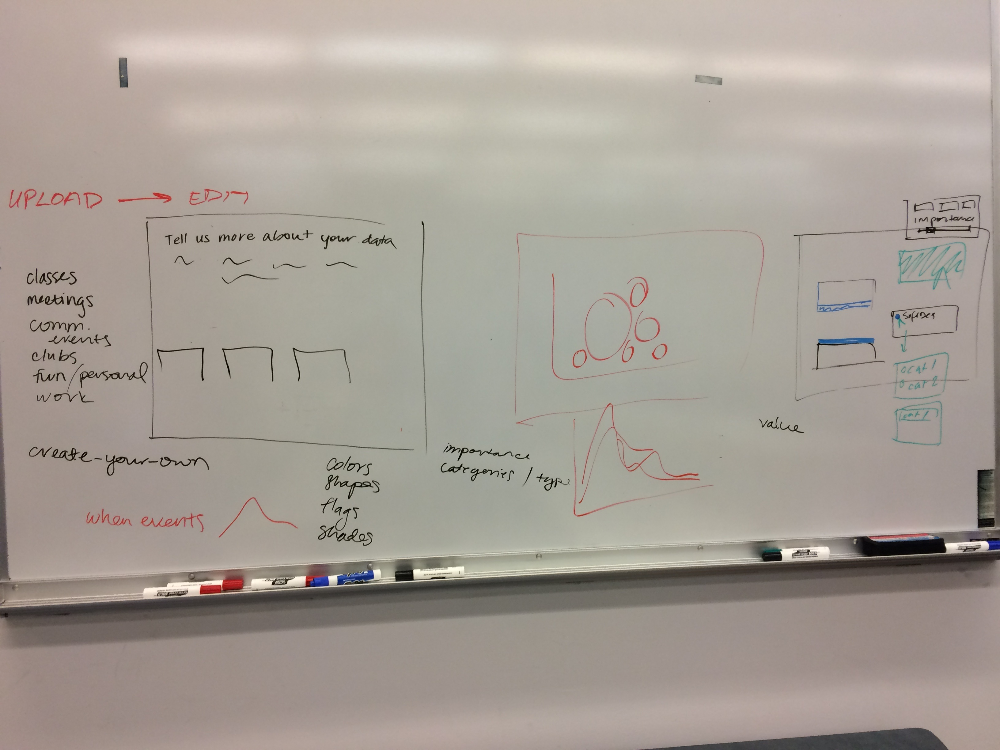

# TR1 Reflection
**Gaby Clarke and Alex Hoppe**

### Process reflection
- We had less we wanted to receive feedback on in this review than in last review
    - We addressed everything we wanted to talk about
- Whiteboard ideation was useful for interface design
    
    
    
- We wish we had brought a demo

### Feedback and decisions
Feedback:
- Editing page interface design ideas:
    - Allow multiple tags for each event
    - Drop-down menu for tagging events
    - Allow users to add tags
    - Defaults: class, meeting, personal, work, club, etc.
    - Stretch: Customizable color tags
    - Back buttons
- A generated key login system (as opposed to a username/password) would be a good fit for our project
    - Allows us to store users' data so that changes made in-software can be accessed later
    - Doesn't require complicated username/password verification
    - Other options include giving the user a file to hold onto
- Database still remains a stretch goal

The Plan:
- Get the heroku app running for the presentation Monday
    - Get uploads working
    - Get visualization rendering
    - Maybe have tagging page
